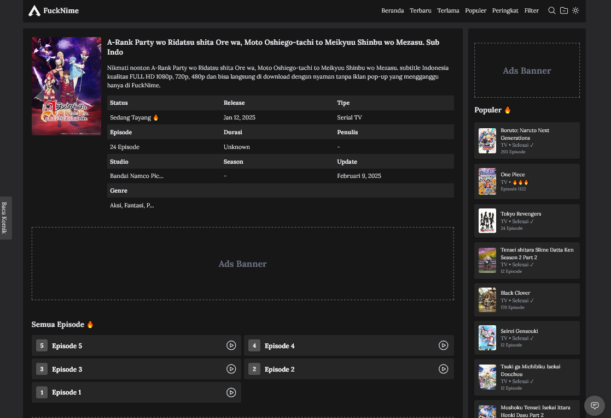
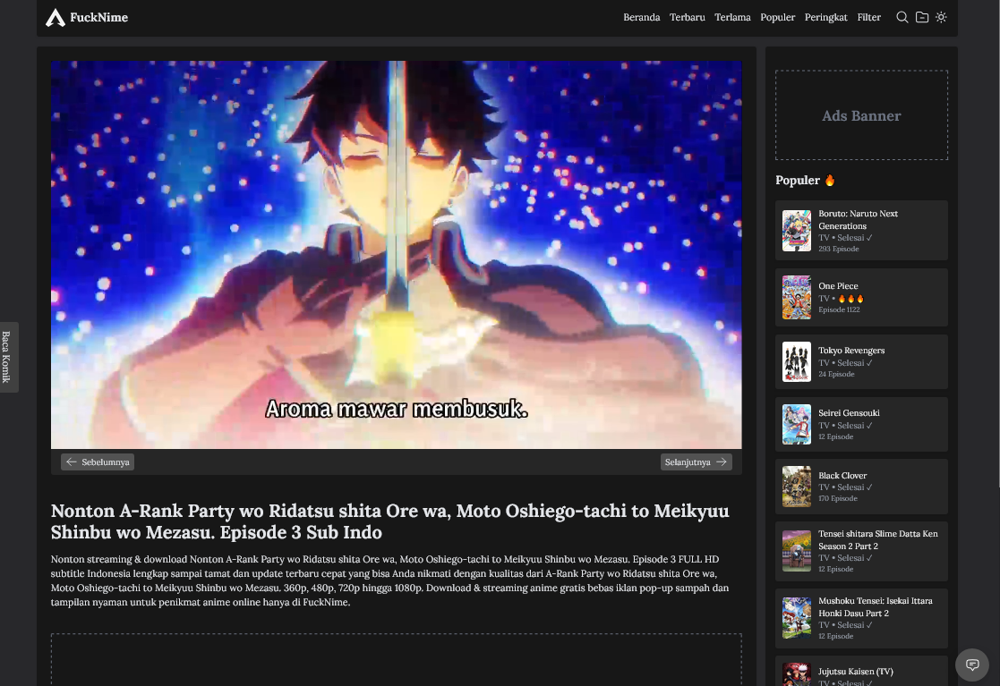
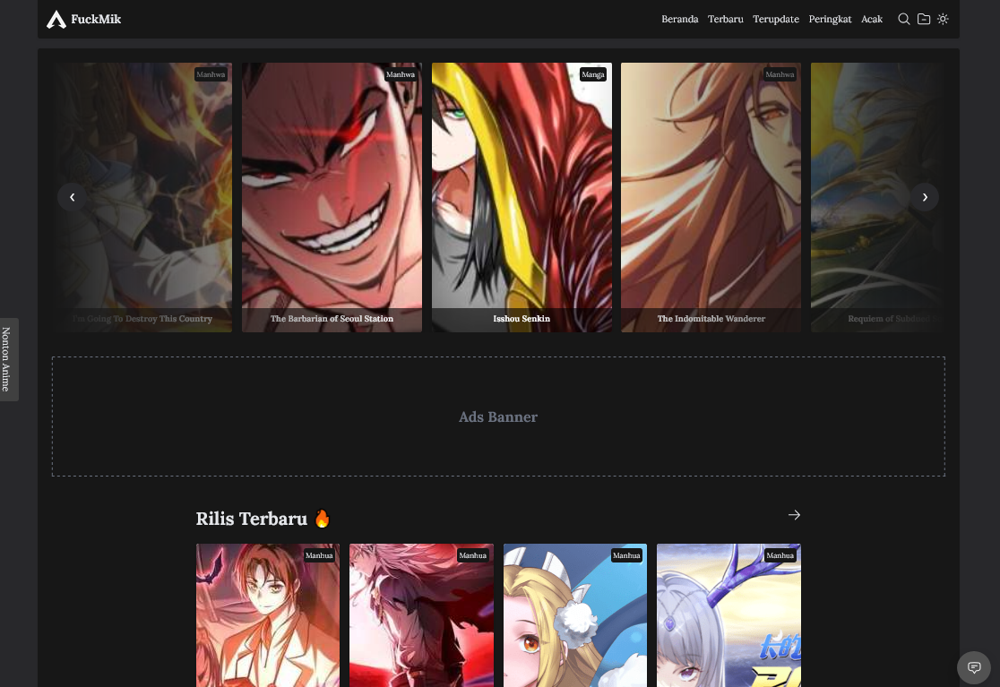
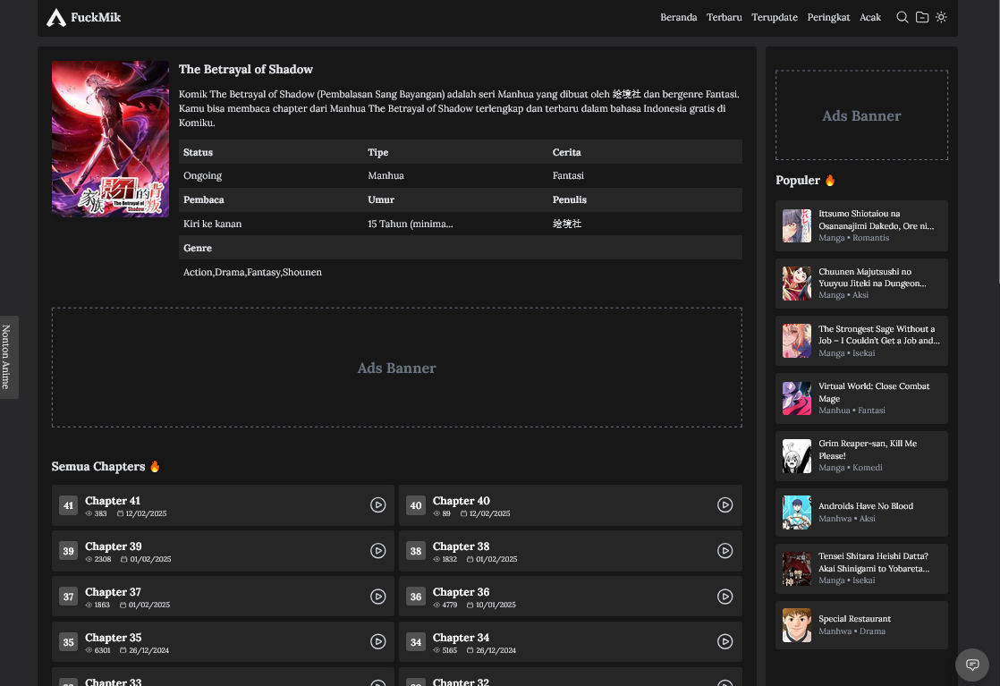
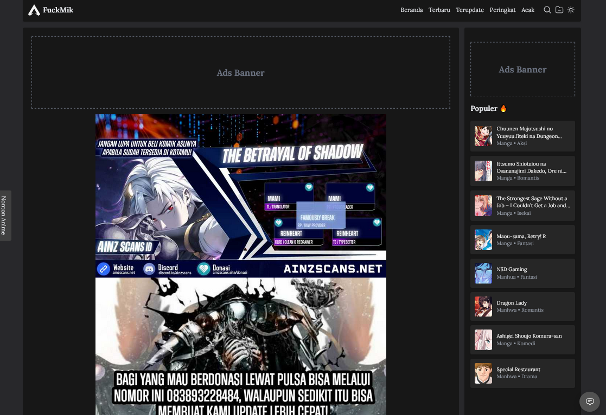
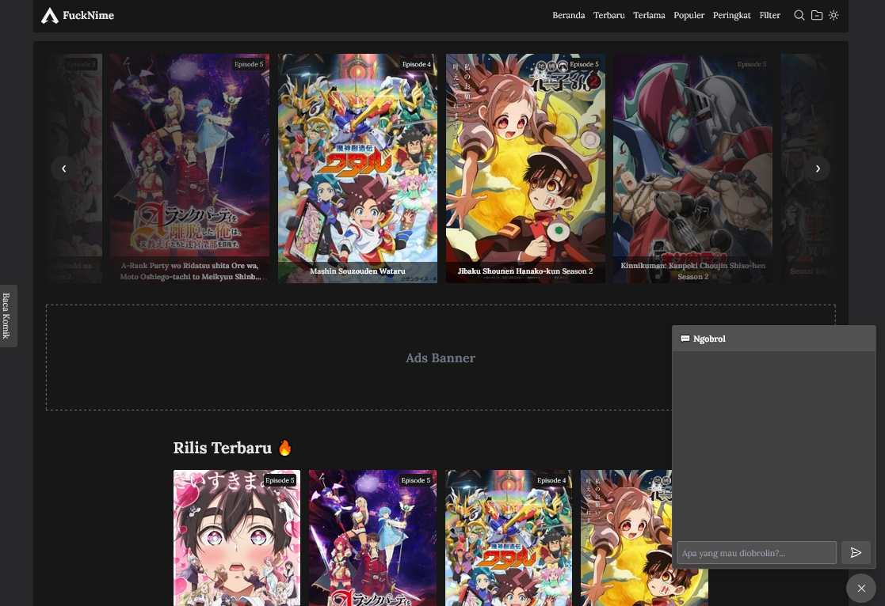

# FuckNime X FuckMik

FuckNime X FuckMik adalah platform inovatif untuk menonton anime dan membaca manga serta manhwa sub indonesia dengan pembaruan data otomatis. Sistem ini mengadopsi teknik web scraping untuk mengambil data secara real-time tanpa memerlukan database, memastikan konten selalu terkini dan relevan.

## Instalasi Web

1. Clone repo:
    ```bash
    git clone https://github.com/fitri-hy/fucknime-nodejs.git
    ```
2. Install dependencies:
    ```bash
    cd fucknime-nodejs
    npm install
    ```
3. Jalankan server:
    ```bash
    npm start
    # atau
    npm run dev
    ```

4. Akses aplikasi via browser:
    ```bash
    http://localhost:3000
    ```

## Instalasi Aplikasi Flutter

1. Konfigurasi Basis URL `App-Flutter/fucknime/lib/config.dart`
	```javascript
	static const String baseUrl = "http://192.168.1.15:3000/v1";
	```

1. Jalankan `App-Flutter/fucknime/`
	```bash
	flutter pub get
	flutter run
	```

## Produksi

1. Sesuaikan URL Socket Realtime Public Chatting `/public/assets/chat-embed.js`

```javascript
const socket = io("http://localhost:3000", {
  transports: ["websocket"],
  upgrade: false
});
```

2. Sesuaikan Basis Url Untuk Dokumentasi Yang Tampil `/database/docs.json`

```json
"content": "Cari disini ..."
```

3. Sesuaikan Basis Url Situs Di `.env`

```bash
BASE_URL='http://localhost:3000'
```

## Kontribusi

Kamu bisa banget bantu develop proyek ini! Cukup fork repo ini, bikin perubahan, dan buat pull request.

1. Fork repo ini
2. Buat branch baru (`git checkout -b feature-xyz`)
3. Lakukan perubahan
4. Commit perubahan (`git commit -am 'Add new feature'`)
5. Push ke branch (`git push origin feature-xyz`)
6. Buat pull request

## Lisensi

Proyek ini dilisensikan di bawah MIT License. Lihat [LICENSE](LICENSE) untuk info lebih lanjut.

## Dukungan

Jika kamu punya pertanyaan atau masalah, buka issue di repo ini, dan kita bakal bantu sebisa mungkin.

#### Download Demo [FuckNime.apk](https://raw.githubusercontent.com/fitri-hy/fucknime-nodejs/refs/heads/main/App-Flutter/fucknime.apk)

---







