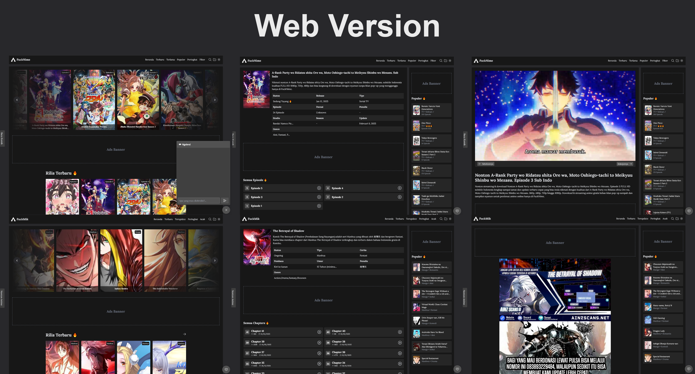

# Selamat Datang Di FuckNime 🖕

**FuckNime** adalah proyek streaming anime bersasis web menggunakan NodeJS. Tanpa database, Otomatis update, Ya, Iyalah kan dat ahasil nyekrep 🖕. dahlah yang penting project ini open-source buat yang minat, gak pake di encrypt kek dev-dev alay.

## Instalasi

1. Clone repo ini:
    ```bash
    git clone https://github.com/fitri-hy/fucknime-nodejs.git
    ```
2. Install dependencies:
    ```bash
    cd fucknime-nodejs
    npm install
    ```
3. Jalankan server:
    ```bash
    npm start
    ```

4. Akses aplikasi via browser:
    ```bash
    http://localhost:3000
    ```

## Produksi

1. Sesuaikan URL Socketnya `/public/assets/chat-embed.js`

```javascript
const socket = io("http://localhost:3000", {
  transports: ["websocket"],
  upgrade: false
});
```

2. Sesuaikan Basis Url Dokumentasi Yang Tampil `/database/docs.json`

```json
"content": "Cari disini ..."
```

## Kontribusi

Lo bisa banget bantu develop proyek ini! Cukup fork repo ini, bikin perubahan, dan buat pull request.

1. Fork repo ini
2. Bikin branch baru (`git checkout -b feature-xyz`)
3. Lakukan perubahan lo
4. Commit perubahan lo (`git commit -am 'Add new feature'`)
5. Push ke branch lo (`git push origin feature-xyz`)
6. Buat pull request

## Lisensi

Proyek ini dilisensikan di bawah MIT License. Lihat [LICENSE](LICENSE) untuk info lebih lanjut.

## Dukungan

Jika lo punya pertanyaan atau masalah, buka issue di repo ini, dan kita bakal bantu sebisa mungkin.

---

**FuckNime** - Website nonton anime tanpa ribet! 🎉




